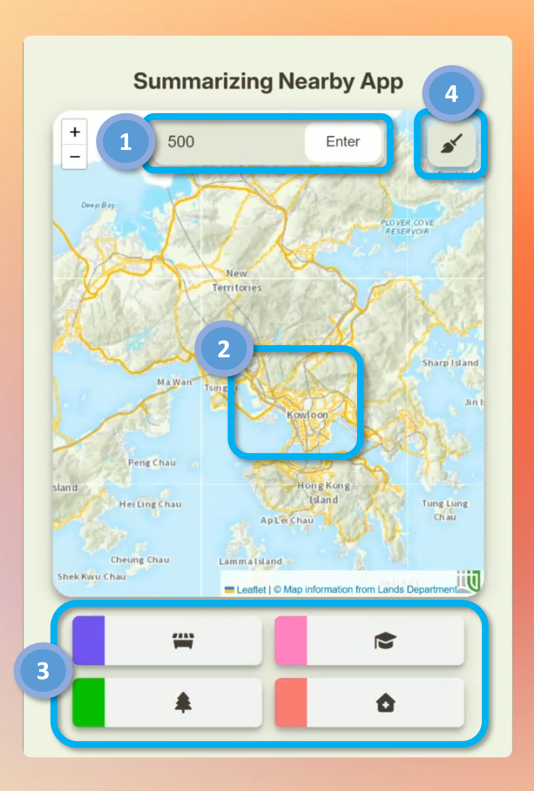

# Leaflet Summarize Nearby App
A minimal web-based mapping application built with Leaflet.js that allows users to explore and summarize nearby community points of interest (e.g., commercial, educational, leisure, health) within a customizable radius around a clicked point in Hong Kong. It uses government basemap tiles from the Lands Department and filters [iGeoCom data](https://portal.csdi.gov.hk/geoportal/?lang=en&datasetId=landsd_rcd_1637225500507_48341) for points of interest.

## Features
- Interactive map centered on Hong Kong with [LandsD topgraphic basemap](https://portal.csdi.gov.hk/csdi-webpage/apidoc/TopographicMapAPI) and [labels](https://portal.csdi.gov.hk/csdi-webpage/apidoc/MapLabelAPI).
- Click anywhere to draw a search circle (default 500m radius) and count nearby facilities by category:
  - `CMF` - Community Facilities
  - `SCH` - Schools
  - `RSF` - Leisure
  - `HNC` - Health Centers
- Update search radius via input field (in meters), "Enter" button and keypress.
- Colored markers for filtered points with tooltips showing Chinese and English names.
- Reset button to clear selections and return to default extent.
- Responsive design with stats displayed in a grid.

## Tech stack
    Leaflet.js 1.9.x
    Turf.js 7
    jQuery 3.7.x

## How to Use:
1. Enter a radius in meters (e.g., 500) and click "Enter" to update.
2. Click on the map to search within the radius.
3. View counts in the stats boxes below the map.
4. Click "Reset" to clear.

## How it works
- On map click, `turf.circle` creates a circle in km around the click.
- `turf.pointsWithinPolygon` filters features inside the circle.
- Counts update for each category; filtered points are drawn with `L.circleMarker`.
- Radius input is in meters; converted to kilometers internally.
